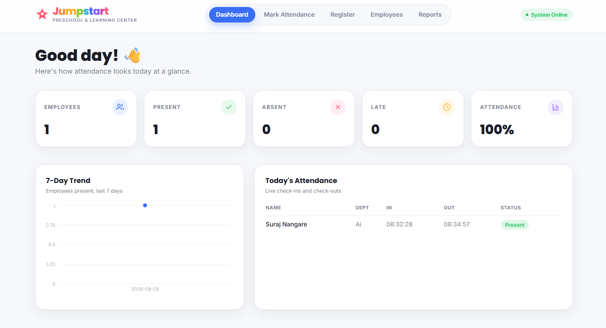
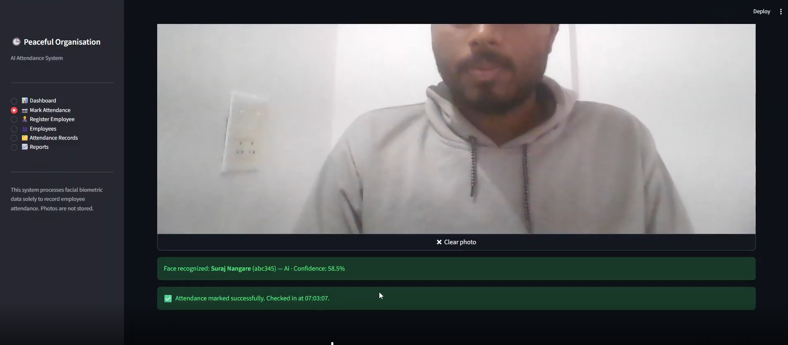
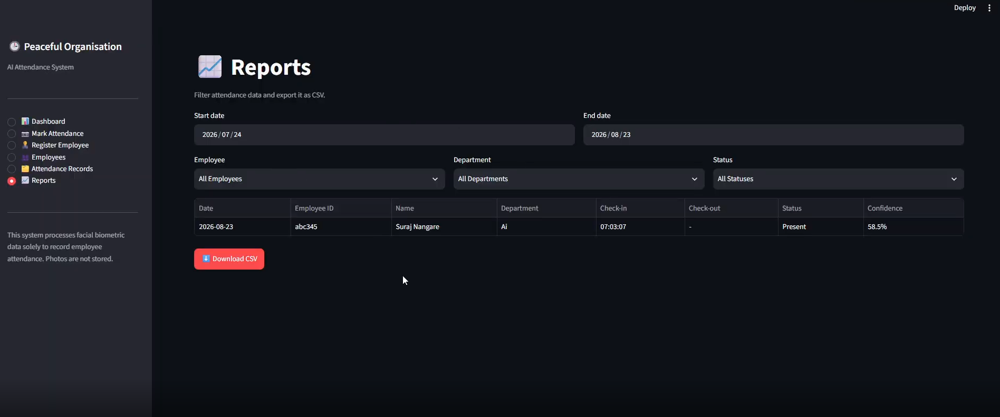

```markdown
# 🕒 AI Attendance System — Peaceful Organisation

A self-contained, AI-powered attendance system that uses **real-time face recognition**
to check employees in and out through a webcam — no ID cards, no manual entry,
no cloud dependency. Runs entirely offline on a single Windows laptop.


🎥 **[Watch the Demo Video](https://drive.google.com/file/d/1OSPbKXmyzcQwjrO9kAMSGuIqmsL6U_uh/view?usp=sharing)**

---

## 📸 Screenshots

| Dashboard | Mark Attendance | Register Employee |
|---|---|---|
|  |  |  |

---

## 📋 Table of Contents

- [Overview](#-overview)
- [Features](#-features)
- [Tech Stack](#-tech-stack)
- [Architecture](#-architecture)
- [Project Structure](#-project-structure)
- [Quick Start (One Click)](#-quick-start-one-click)
- [Manual Setup](#-manual-setup)
- [Usage Guide](#-usage-guide)
- [Configuration](#-configuration)
- [Testing](#-testing)
- [Troubleshooting](#-troubleshooting)
- [Privacy](#-privacy)
- [Future Improvements](#-future-improvements)

---

## 🔍 Overview

Administrators register each employee once with a face photo. From then on,
employees simply look at the webcam on the **Mark Attendance** page — the
system detects and recognizes their face and automatically records a
**check-in** (first recognition of the day) or **check-out** (second
recognition). An admin dashboard shows daily attendance at a glance, with
filterable reports exportable to CSV.

---

## ✨ Features

- 🧑‍💼 Employee registration with photo upload or webcam capture
- 🎯 Face detection + embedding generation via **InsightFace**
- 📷 Webcam-based recognition with automatic check-in/check-out
- 🚫 Rejects **unknown faces** and **multi-face frames** — no false attendance
- ⏱️ Configurable office start time with automatic **Late** status
- 🔁 Debounce/cooldown so the same person isn't reprocessed every frame
- 📊 Live dashboard — present/absent, department breakdown, trend charts
- 👥 Employee management with safe delete (confirmation required)
- 📁 Filterable attendance reports with **CSV export**
- 🔒 Face embeddings never exposed in the UI
- 💬 Friendly, non-technical status and error messages

---

## 🛠 Tech Stack

| Layer | Technology |
|---|---|
| UI / Dashboard | **Streamlit** |
| Face Detection & Recognition | **InsightFace** + **ONNX Runtime** |
| Image Handling | **OpenCV**, **Pillow** |
| Database | **SQLite** |
| Data Processing | **Pandas**, **NumPy** |
| Configuration | **python-dotenv** |
| Language | **Python 3.11** |

---

## 🏗 Architecture

```
Webcam / Upload → OpenCV/PIL frame → InsightFace detection
   → face embedding → cosine-similarity match against registered employees
   → attendance service (check-in/check-out + late + cooldown rules)
   → SQLite → Streamlit dashboard / reports → CSV export
```

The code is split into clean, testable layers:

| Layer | Responsibility |
|---|---|
| `app/database` | SQLite connection + all SQL (repository pattern) |
| `app/face` | InsightFace wrapper, embedding comparison, recognition logic |
| `app/attendance` | Check-in/check-out business rules, late detection, cooldown |
| `app/ui` | One Streamlit page per module — UI only, no SQL or model calls |
| `app/utils` | Shared helpers (image conversion, CSV export, formatting) |

This separation means the attendance rules and database logic are fully
unit-testable **without** loading a camera or a face model.

---

## 📁 Project Structure

```
ai-attendance-system/
├── app/
│   ├── main.py               # Streamlit entry point & navigation
│   ├── config.py             # Settings loaded from .env
│   ├── database/
│   │   ├── connection.py     # SQLite connection + schema
│   │   ├── models.py         # Employee / AttendanceRecord dataclasses
│   │   └── repository.py     # All SQL queries
│   ├── face/
│   │   ├── detector.py       # InsightFace wrapper (FaceEngine)
│   │   ├── embeddings.py     # Cosine similarity / best-match logic
│   │   └── recognizer.py     # Registration & recognition workflows
│   ├── attendance/
│   │   └── service.py        # Check-in/out rules, late logic, cooldown
│   ├── ui/
│   │   ├── dashboard.py
│   │   ├── registration.py
│   │   ├── recognition.py
│   │   ├── employees.py
│   │   ├── records.py
│   │   └── reports.py
│   └── utils/
│       └── helpers.py
├── data/                      # SQLite database lives here (gitignored)
├── screenshots/               # README images
├── tests/
│   └── test_attendance.py
├── .env.example
├── .gitignore
├── requirements.txt
├── README.md
├── start.bat                  # One-click launcher (Windows)
└── run.py
```

---

## 🚀 Quick Start (One Click)

The easiest way to run this project — no command-line steps needed.

1. Download/clone the repository
2. Double-click **`start.bat`**

That's it. The script automatically:
- Creates a virtual environment *(first run only)*
- Installs all dependencies *(first run only)*
- Copies `.env.example` → `.env` *(first run only)*
- Launches the app in your browser

> ⚠️ On the **very first run**, InsightFace also downloads its face
> recognition model (~a few hundred MB) — this needs internet access and
> takes a minute or two, but only happens once.

---

## ⚙️ Manual Setup

If you prefer running it via command line:

### 1. Prerequisites
- Python 3.11 installed and added to PATH ([python.org](https://www.python.org/downloads/))
- A working webcam

### 2. Create a virtual environment
```bash
python -m venv venv
venv\Scripts\activate
```

### 3. Install dependencies
```bash
pip install --upgrade pip
pip install -r requirements.txt
```

### 4. Configure environment variables
```bash
copy .env.example .env
```

### 5. Run the app
```bash
streamlit run run.py
```

The app opens automatically at `http://localhost:8501`.

---

## 📖 Usage Guide

### Register an Employee
1. Open **Register Employee** from the sidebar
2. Enter Employee ID, Name, and Department
3. Upload a clear photo (or capture one via webcam) with **exactly one face**
4. Click **Register Employee**

Duplicate IDs and invalid photos (no face / multiple faces) are rejected with clear messages.

### Mark Attendance
1. Open **Mark Attendance**
2. Take a photo using the webcam capture button
3. The system responds with one of:
   - ✅ **Face recognized** → attendance marked automatically
   - ❌ **Unknown person** → no attendance recorded
   - ⚠️ **No face / multiple faces detected** → try again

### Check-in / Check-out Logic
- **1st** valid recognition of the day → **Check-in** (marked `Late` if after office start time)
- **2nd** valid recognition → **Check-out**
- **3rd+** recognition that day → no changes made (prevents duplicate/overwritten records)
- A short **cooldown** (default 30s) prevents repeated processing while someone lingers in frame

---

## 🔧 Configuration

All settings live in `.env` (see `.env.example`):

| Variable | Description | Default |
|---|---|---|
| `ORGANISATION_NAME` | Displayed in the sidebar | Peaceful Organisation |
| `DATABASE_PATH` | SQLite file location | `data/attendance.db` |
| `FACE_MATCH_THRESHOLD` | Cosine similarity cutoff (0–1) for a match | `0.45` |
| `CAMERA_INDEX` | Webcam index | `0` |
| `INSIGHTFACE_MODEL` | InsightFace model pack | `buffalo_l` |
| `OFFICE_START_TIME` | 24h `HH:MM`; check-ins after this are "Late" | `09:00` |
| `ATTENDANCE_COOLDOWN_SECONDS` | Debounce window per person | `30` |

---

## 🧪 Testing

Run the automated test suite:

```bash
python -m pytest tests/ -v
```

Covers:
- Employee creation & duplicate ID prevention
- Attendance creation & duplicate attendance prevention
- Late status calculation
- Full check-in / check-out state machine

---

## 🐛 Troubleshooting

| Issue | Fix |
|---|---|
| "No face detected" | Ensure good lighting and your face fills a reasonable part of the frame |
| Webcam doesn't appear | Check browser camera permissions for `localhost`; close other apps using the camera |
| InsightFace install fails | Ensure 64-bit Python 3.11; try `pip install onnxruntime` first, then `insightface` |
| First recognition is slow | Normal — the model loads once, then stays fast |
| Wrong matches / too many "Unknown" | Adjust `FACE_MATCH_THRESHOLD` in `.env` (lower = more lenient) |

---

## 🔒 Privacy

This system processes facial biometric data **solely** for attendance purposes:

- Webcam frames are processed in memory and **never saved to disk** — only the resulting embedding (a numeric vector) is stored
- Face embeddings are **never exposed** in the UI
- No secrets are hard-coded — all configuration via environment variables
- `.gitignore` excludes the database and `.env` file so real employee data is never committed

> Organisations deploying this system should obtain appropriate employee
> consent for biometric data processing in line with local regulations.

---

## 🔮 Future Improvements

- Live continuous video recognition (currently snapshot-based for simplicity)
- Multi-camera / multi-location support
- Role-based admin authentication
- Email/Slack notifications for late arrivals
- Liveness detection to prevent photo spoofing

---
```

